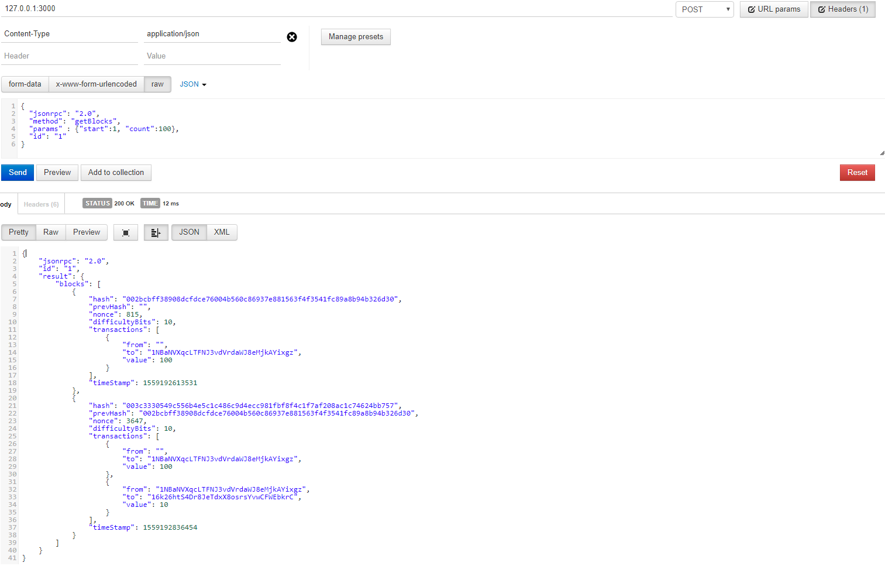

# TestBlock
- blockchain study 를 위해 개발중인 test blockchain

# test 환경
- windows10
- node 10.15.3
- npm 6.4.1

# dependency module
- express
- bitcoinlib-js
- mocha
- node-express-json-rpc2-async

# install
- nodeJS version 10 이상 설치 필요
    - https://nodejs.org/ko/download/
- windows build 도구 설치
    - npm install --global windows-build-tools
    - https://www.npmjs.com/package/windows-build-tools
- project download
    - git clone https://github.com/leeheejoo/TestBlock.git
- dependency module 설치
    - npm install
- test module 설치
    - npm install mocha --global

# config
- 위치: {Project}/config/config.js
- 설명
    - port : rpc port (default:3000)
    - blockReward : 블록 보상 (default:100)
    - difficultyBits : 난이도 설정 값 (0 ~ 256, default:10)

# 실행
- npm start

# test
- mocha

# project 특징
- 기능
    - account 생성 기능 (account 기반, not utxo)
        - address는 bitcoin legacy p2pkh로 생성
    - transaction 생성 기능
        - transfer 기능 추가
        - 거래 수수료 없음
        - transaction sign 기능 미구현
    - block 생성 기능
        - generateBlock rpc 호출로 생성
        - block 보상(coinbase 보상) 기능 추가
    - block 검증 기능
        - genensys block 부터 chain을 다시 생성하여 기존에 저장된 block hash값을 비교하여 검증
    - consensus 알고리즘
        - pow 사용
    - rpc 기능 
        - json-rpc2, 보안기능 미적용
    - 저장소는 file 및 db를 사용하지 않고 memory에만 올려 놓음
        - 프로그램 재시작 하면 모든 블록이 지워짐

# module 설명
- account : 계정 정보를 나타내며 balance 정보를 포함하고 address 생성 기능이 있음
- block : 블록 정보를 나타내며 block hash, previous block hash, nonce, difficultyBits, transactions, block create time 정보가 있음
- chain : block chain을 control하기 위한 wrapper class로 저장소 정보를 포함하며 accont 생성, transaction transfer, generate block등의 기능을 수행함
- consensus : pow 함의를 위한 기능 및 chain 검증기능을 포함함.
- miner : block을 생성하는 기능을 포함함
- storage : chain 정보 및 world state(accounts) 정보를 저장하는 저장소. 아직 file or DB로 저장하지 않고 memory로 저장.
- transaction : tansaction 정보를 나타내며 from, to, value 정보를 포함한다.
- utils : sha256, hash160, hash256 함수 포함
- rpcs : 11종의 api 기능 포함 
- test : 단위 test 실행

# apis
    - 테스트 주소 : http://127.0.0.1:3000

    - json-rpc2, post-type, request시 header에 Content-Type : application/json 추가 필요

    - getCoinbaseAddress
        - coinbase address를 조회함
        - header
            - Content-Type : application/json
        - result 
            - coinbase address or error
        - example
            - request body
                { 
                    "jsonrpc": "2.0", 
                    "method": "getCoinbaseAddress", 
                    "id": "1"
                }
            - response body
                {
                    "jsonrpc": "2.0",
                    "id": "1",
                    "result": {
                        "address": "1NBaNVXqcLTFNJ3vdVrdaWJ8eMjkAYixgz"
                    }
                }

    - setCoinbaseAddress
        - coinbase address를 설정함
        - header
            - Content-Type : application/json
        - parameter
            - address
        - result 
            - success or fail or error
        - example
            - request body
                { 
                    "jsonrpc": "2.0", 
                    "method": "setCoinbaseAddress", 
                    "params" : {"address":"1NBaNVXqcLTFNJ3vdVrdaWJ8eMjkAYixgz"},
                    "id": "1"
                }
            - response body
                {
                    "jsonrpc": "2.0",
                    "id": "1",
                    "result": "success"
                }

    - getNewAddress
        - 새로운 account(address)를 생성함
        - header
            - Content-Type : application/json
        - result 
            - address or error
        - example
            - request body
                { 
                    "jsonrpc": "2.0", 
                    "method": "getNewAddress", 
                    "id": "1"
                }
            - response body
                {
                    "jsonrpc": "2.0",
                    "id": "1",
                    "result": {
                        "address": "16k26htS4Dr8JeTdxX8osrsYvwCFWEbkrC"
                    }
                }

    - getAccounts
        - 모든 account 정보를 조회함
        - header
            - Content-Type : application/json
        - result 
            - address list or error
        - example
            - request body
                { 
                    "jsonrpc": "2.0", 
                    "method": "getAccounts", 
                    "id": "1"
                }
            - response body
                {
                    "jsonrpc": "2.0",
                    "id": "1",
                    "result": {
                        "accounts": [
                            {
                                "balance": 0,
                                "address": "1NBaNVXqcLTFNJ3vdVrdaWJ8eMjkAYixgz"
                            },
                            {
                                "balance": 0,
                                "address": "16k26htS4Dr8JeTdxX8osrsYvwCFWEbkrC"
                            }
                        ]
                    }
                }

    - getBalance
        - 특정 address에 대한 balance를 조회함
        - header
            - Content-Type : application/json
        - parameter
            - address
        - result 
            - balance or error
        - example
            - request body
                { 
                    "jsonrpc": "2.0", 
                    "method": "getBalance", 
                    "params" : {"address":"1NBaNVXqcLTFNJ3vdVrdaWJ8eMjkAYixgz"},
                    "id": "1"
                }
            - response body
                {
                    "jsonrpc": "2.0",
                    "id": "1",
                    "result": {
                        "address": "1NBaNVXqcLTFNJ3vdVrdaWJ8eMjkAYixgz",
                        "balance": 0
                    }
                }

    - transfer
        - 거래를 생성함
        - header
            - Content-Type : application/json
        - parameter
            - from : 보내는 account의 address
            - to   : 받는 account의 address
            - value: 보내는 coin amount 
        - result 
            - success or fail or error
        - example
            - request body
                { 
                    "jsonrpc": "2.0", 
                    "method": "transfer", 
                    "params" : {"from":"1NBaNVXqcLTFNJ3vdVrdaWJ8eMjkAYixgz", "to":"16k26htS4Dr8JeTdxX8osrsYvwCFWEbkrC", "value":10},
                    "id": "1"
                }
            - response body
                {
                    "jsonrpc": "2.0",
                    "id": "1",
                    "result": "success"         // tx sign 기능 미구현으로 txid(hash)값 대신 success or fail 정보를 반환
                }

    - generateBlock
        - 새로운 block을 생성함
        - header
            - Content-Type : application/json
        - result 
            - block hash or error
        - example
            - request body
                { 
                    "jsonrpc": "2.0", 
                    "method": "generateBlock", 
                    "id": "1"
                }
            - response body
                {
                    "jsonrpc": "2.0",
                    "id": "1",
                    "result": {
                        "hash": "003c3330549c556b4e5c1c486c9d4ecc981fbf8f4c1f7af208ac1c74624bb757"
                    }
                }

    - getBlockHeight
        - block height를 조회함
        - header
            - Content-Type : application/json
        - result 
            - block height or error
        - example
            - request body
                { 
                    "jsonrpc": "2.0", 
                    "method": "getBlockHeight", 
                    "id": "1"
                }
            - response body
                {
                    "jsonrpc": "2.0",
                    "id": "1",
                    "result": {
                        "height": 2
                    }
                }

    - getBlock
        - 특정 block 정보를 조회함
        - header
            - Content-Type : application/json
        - parameter
            - block hash
        - result 
            - block or error
        - example
            - request body
                { 
                    "jsonrpc": "2.0", 
                    "method": "getBlock", 
                    "params" : {"hash":"003c3330549c556b4e5c1c486c9d4ecc981fbf8f4c1f7af208ac1c74624bb757"},
                    "id": "1"
                }
            - response body
                {
                    "jsonrpc": "2.0",
                    "id": "1",
                    "result": {
                        "block": {
                            "hash": "003c3330549c556b4e5c1c486c9d4ecc981fbf8f4c1f7af208ac1c74624bb757",
                            "prevHash": "002bcbff38908dcfdce76004b560c86937e881563f4f3541fc89a8b94b326d30",
                            "nonce": 3647,
                            "difficultyBits": 10,
                            "transactions": [
                                {
                                    "from": "",                                         // coinbase
                                    "to": "1NBaNVXqcLTFNJ3vdVrdaWJ8eMjkAYixgz",
                                    "value": 100
                                },
                                {
                                    "from": "1NBaNVXqcLTFNJ3vdVrdaWJ8eMjkAYixgz",
                                    "to": "16k26htS4Dr8JeTdxX8osrsYvwCFWEbkrC",
                                    "value": 10
                                }
                            ],
                            "timeStamp": 1559192836454
                        }
                    }
                }

    - getBlocks
        - 복수의 block 정보를 조회함, start는 1부터 시작, count는 1보다 커야함
        - header
            - Content-Type : application/json
        - parameter
            - start : 조회할 첫번째 block의 height
            - count : 조회할 block의 수
        - result 
            - block list or error
        - example
            - request body
                { 
                    "jsonrpc": "2.0", 
                    "method": "getBlocks", 
                    "params" : {"start":1, "count":100},
                    "id": "1"
                }
            - response body
                {
                    "jsonrpc": "2.0",
                    "id": "1",
                    "result": {
                        "blocks": [
                            {
                                "hash": "002bcbff38908dcfdce76004b560c86937e881563f4f3541fc89a8b94b326d30",
                                "prevHash": "",                                                                 // genesys block
                                "nonce": 815,
                                "difficultyBits": 10,
                                "transactions": [
                                    {
                                        "from": "",
                                        "to": "1NBaNVXqcLTFNJ3vdVrdaWJ8eMjkAYixgz",
                                        "value": 100
                                    }
                                ],
                                "timeStamp": 1559192613531
                            },
                            {
                                "hash": "003c3330549c556b4e5c1c486c9d4ecc981fbf8f4c1f7af208ac1c74624bb757",
                                "prevHash": "002bcbff38908dcfdce76004b560c86937e881563f4f3541fc89a8b94b326d30",
                                "nonce": 3647,
                                "difficultyBits": 10,
                                "transactions": [
                                    {
                                        "from": "",
                                        "to": "1NBaNVXqcLTFNJ3vdVrdaWJ8eMjkAYixgz",
                                        "value": 100
                                    },
                                    {
                                        "from": "1NBaNVXqcLTFNJ3vdVrdaWJ8eMjkAYixgz",
                                        "to": "16k26htS4Dr8JeTdxX8osrsYvwCFWEbkrC",
                                        "value": 10
                                    }
                                ],
                                "timeStamp": 1559192836454
                            }
                        ]
                    }
                }

     - verifyChain
        - chain에 포함된 모든 block을 검증함
        - header
            - Content-Type : application/json
        - result 
            - 검증 결과 or error
        - example
            - request body
                { 
                    "jsonrpc": "2.0", 
                    "method": "verifyChain", 
                    "id": "1"
                }
            - response body
                {
                    "jsonrpc": "2.0",
                    "id": "1",
                    "result": {
                        "result": "success",
                        "details": [
                            {
                                "height": 1,
                                "blockHash": "002bcbff38908dcfdce76004b560c86937e881563f4f3541fc89a8b94b326d30",
                                "verifyHash": "002bcbff38908dcfdce76004b560c86937e881563f4f3541fc89a8b94b326d30"
                            },
                            {
                                "height": 2,
                                "blockHash": "003c3330549c556b4e5c1c486c9d4ecc981fbf8f4c1f7af208ac1c74624bb757",
                                "verifyHash": "003c3330549c556b4e5c1c486c9d4ecc981fbf8f4c1f7af208ac1c74624bb757"
                            }
                        ]
                    }
                }

# api test screenshot

# example
- chain verify 확인 절차
    1. generateBlock api 호출로 genesys block 생성 ( coinbase balance 100 생성)
    2. getNewAddress api 호출로 account 생성
    3. transfer api 호출,
        - from : coinbase, to : getNewAddress로 생성한 주소, value : 10
        - coinbase 주소는 getCoinbaseAddress api 호출로 확인 가능
    4. getAccounts 호출로 account 정보 확인
        - transfer를 했지만 아직 블럭을 생성하지 않아 coinbase balance 100, to address balance는 0
    5. generateBlock api 호출로 두번째 block 생성, 현재 chain에 포함된 블럭정보는 getBlcoks api를 호출하여 확인 가능
        - coinbase balance는 190, to address balance는 10
        - getAccount api를 호출하여 확인 가능
    6. 1~5번 과정과 같이 새로운 주소 생성, 거래, 블록 생성을 여러번 함
    7. verifyChain api를 호출하여 genesys block 부터 현재 block 까지 hash 값을 검증
        - 검증 결과값이 success면 성공, fail이면 실패